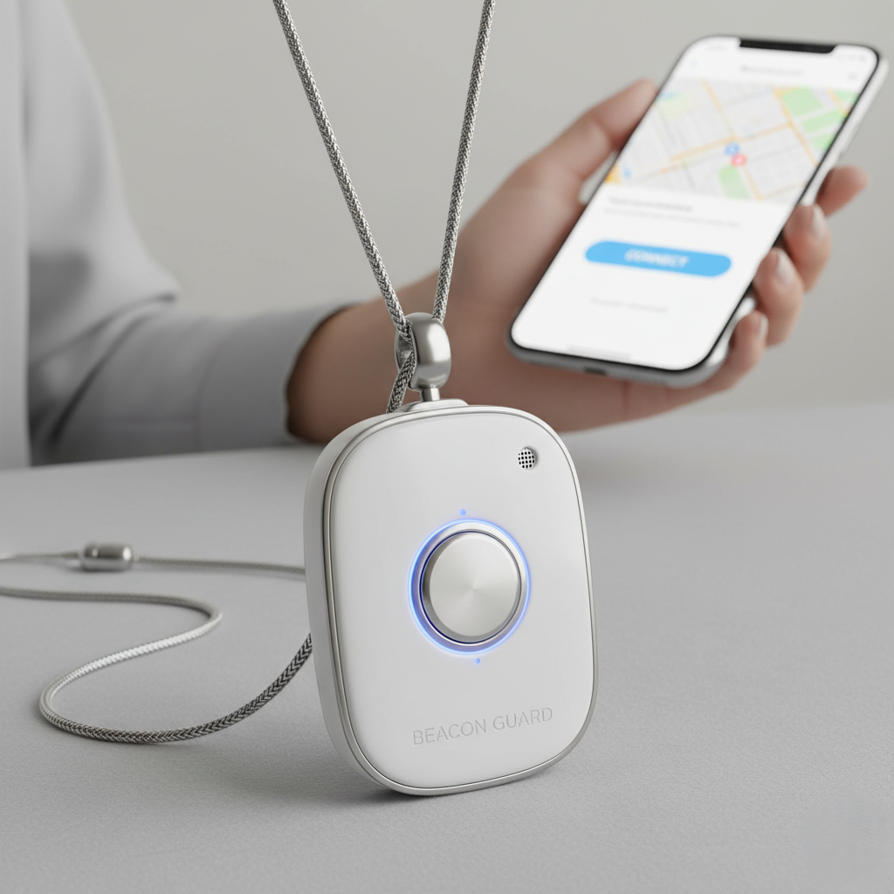
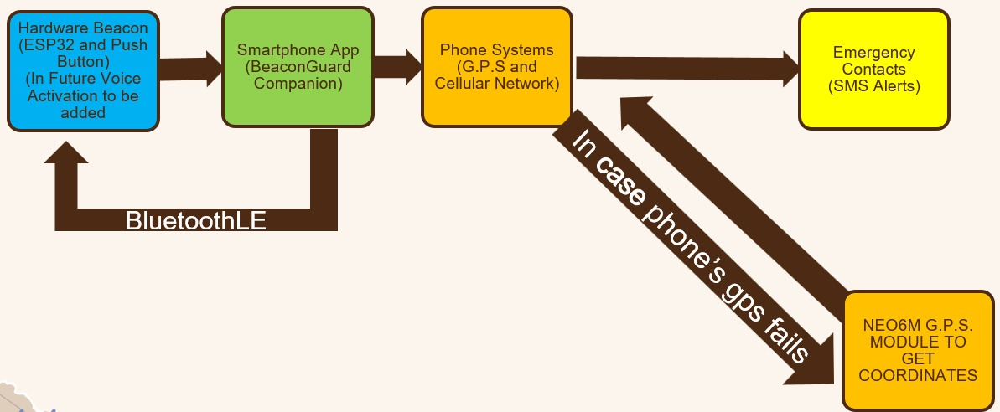
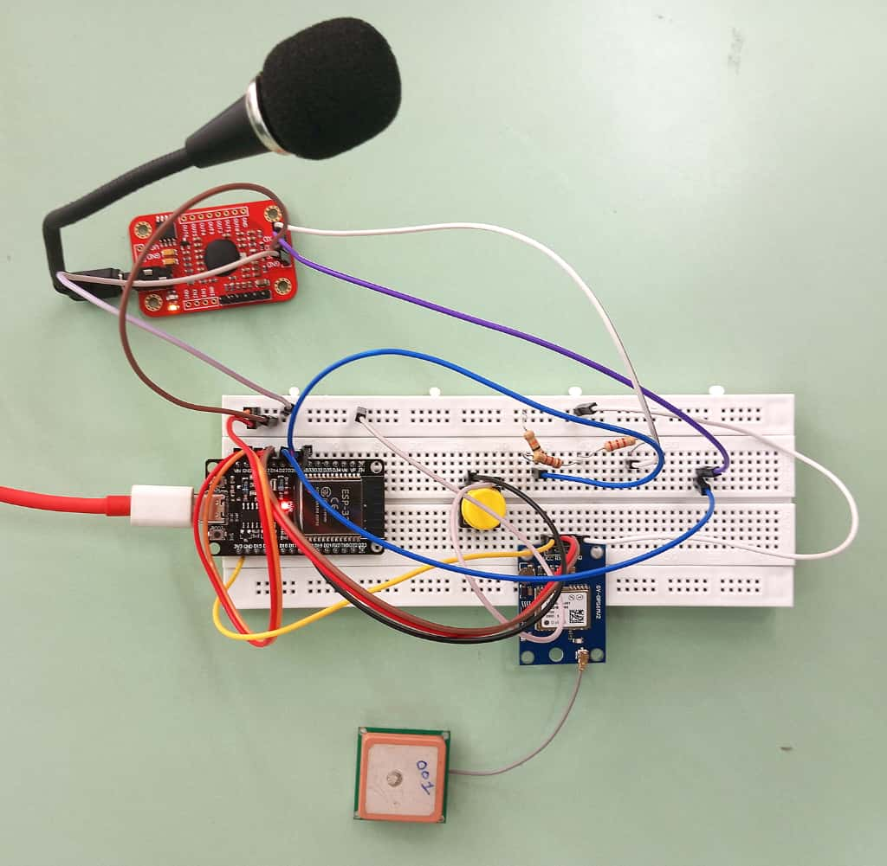
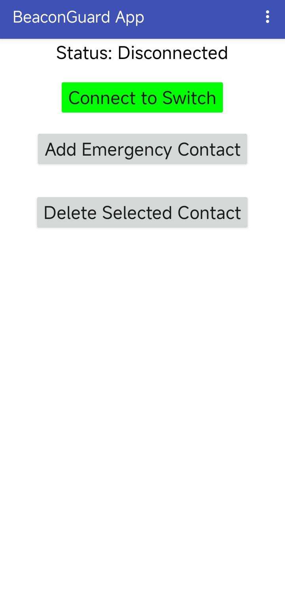
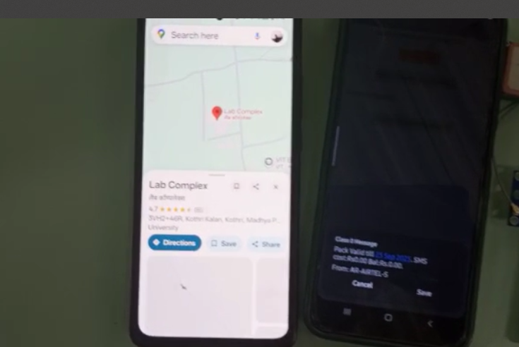

# Beacon Guard – ESP32 Based Personal Safety & Emergency Alert System

## Overview
**Beacon Guard** is a portable personal safety system built on the **ESP32 microcontroller**.  
It allows users to send emergency alerts using either a **push button** or a **voice command ("HELP")**.  

The system retrieves **GPS location** and communicates with a companion **smartphone app** via **Bluetooth Low Energy (BLE)**. The app intelligently decides the GPS source (phone or beacon) and sends an **SMS with alert + location** to predefined emergency contacts.

---

## Features
- **Dual Alert System** → Trigger alerts using button press or voice command.  
- **GPS Tracking** → Uses NEO-6M GPS or phone GPS (smart prioritization).  
- **BLE Communication** → Reliable ESP32 ↔ Smartphone App connection.  
- **SMS Dispatch** → Sends alert message + live location via SMS.  
- **Low-Cost & Portable** → Suitable for women, children, elderly, travelers, and medical patients.  
- **Works in low-internet areas** → Uses SMS, not dependent on data connection.  

---

## Hardware Components
- ESP32 Development Board (NodeMCU-32S)  
- Elechouse VR3 Voice Recognition Module  
- NEO-6M GPS Module  
- Push Button  
- Smartphone (Android, MIT App Inventor App)  

---

## Pin Connections
| Component              | ESP32 Pin   |
|-------------------------|-------------|
| Push Button             | GPIO25      |
| VR3 RX (to ESP32 TX2)   | GPIO27      |
| VR3 TX (to ESP32 RX2)   | GPIO26      |
| GPS RX (to ESP32 TX1)   | GPIO13      |
| GPS TX (to ESP32 RX1)   | GPIO12      |

---

## Final Wearable Device

The final prototype has been miniaturized and designed as a **wearable necklace device** for ease of use.  
This wearable design makes it comfortable for women to carry in daily life while ensuring safety features are always accessible.

## Smartphone Application
- Developed using **MIT App Inventor**  
- Connects to ESP32 over **BLE**  

### Features:
- Connect/disconnect ESP32  
- Receive alert notifications  
- GPS smart logic (phone GPS > beacon GPS fallback)  
- Send SMS alerts with live location  

---

## Firmware (ESP32)
- Written in **Arduino (C++)**  

### Functions:
- Initialize BLE service  
- Configure button interrupts  
- Parse GPS data via TinyGPS++  
- Process VR3 voice commands (trained for “HELP”)  
- Send BLE Alerts + GPS coordinates  

---

## Voice Recognition (VR3 Training)
The **VR3 module** was trained with the following command:

- Group ID: **2**  
- Command: **HELP**  

---

## Installation & Setup
### Hardware Setup
1. Connect ESP32 with VR3, GPS, and Push Button (see pinout table).  
2. Upload firmware using **Arduino IDE**.  
3. Power up the ESP32.  

### Smartphone Setup
1. Install the **Beacon Guard App** (MIT App Inventor build).  
2. Pair smartphone with ESP32 via **Bluetooth Low Energy**.  
3. Add emergency contacts inside the app.  
4. Trigger alert → check SMS delivery with live GPS.  

---

## System Workflow
1. User presses button or says “HELP”.  
2. ESP32 detects input → sends Alert + GPS to phone via BLE.  
3. Smartphone app:
   - Uses phone GPS (if available) else beacon GPS.  
   - Sends SMS with Alert Type + Location to predefined contacts.  
4. Contact receives SMS Alert with **Google Maps link**.  

---

## Block Diagram
## Block Diagram

---
## Screenshots & Photos

### Hardware Setup

### Mobile App UI

### Alert SMS Example

---

## Future Scope
- Integration with **LoRa / GSM module** (direct SMS without smartphone).  
- **Cloud-based location tracking dashboard**.  
- Support for **multiple custom voice commands**.  
- **Wearable form-factor** (smartwatch / pendant).  

---

## Team Members
- **Shiva Singh**  
- **Suryaion Mukherjee**  
- **Aarya Parua**  

**Guide:** Dr. Soumitra Keshari Nayak  
**Institute:** VIT Bhopal University  

---

## License
This project is licensed under the **MIT License** – free to use, modify, and distribute with attribution.

